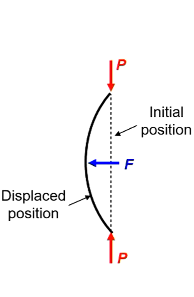

# Intro to Structural Analysis

Content Tags: Hookes Law, Internal Loads, Strain, Stress, Supports
Created: March 6, 2022 9:10 AM

## Stress

- Stress on a small element of a material under load
- 2 types of stresses:
  - Normal
  - Shear
- Ask what does a load do to a cross section?
  - What loads are there? Moments? Stresses?

## Shear and Normal stress produce fundamentally different forces in the material

- Normal is a compressive or stretching action
- Shear is considered as though it acts on a plane

## What is strain? What are the units of strain?

- Strain is a change in material distortion under the effect of a stress
- The units are dimensionless (Change in Length/Length)

## What is normal strain? What is shear strain?

- Normal strain acts through the cross section of the body to lengthen or contract it
- Shear strain creates torsion and warping

## What is a positive and negative normal strain?

- Positive normal acts in torsion
- Negative acts to compress

## What is a positive and negative shear strain?

- Positive and negative only alters the direction of the torsion. So clockwise or counter-clockwise

## Normal Strain is?

- The slope of displacement

## Shear Strain is? 

- Still non-dimensional
- Relationship??

## Poisson’s ratio?

- Ratio of strains. Reaction strain acting in orthogonal direction is cause by original strain.

## Hooke’s Law?

- Constant Value = Stress/Strain, while elastic.

## Plane (2D) Problems

- Disregard a particular aspect because nothing important is happening in the other access out of plane. This needs to be carefully evaluated.

## Beams and Plates

- Take a beam and extrude it for plates
- Plates have a poisson effect that beams don’t have

## 2D State of Stress

- Your stresses are dependant on your coordinate system
- Can resolve state of stress into principal stress
- Use Moores circle
- A cylinder under normal tension will fracture vertically
- A cylinder under shear will fracture diagonally. Imagine the shear diagram deforming a square into a kite shape.

## Aircraft Materials

- Common Materials:
  - Metals (Most discussed)
  - composites
  - Sandwich

## Static Equivalence

- Same forces and same moments
- Internal loads must be equivalent to the external load that is acting on the body.
- Internal reaction loads are equal and opposite. The internal loads are not.

## Partial Derivative

- The partial derivative is the derivative of a function with respect to one variable only
- This gives the rate of change, or slope, of a function with respect to one variable

## Support Conditions

- Import drawings for supports. (Roller, Fixed, Pin). Add degree of freedom info.
- Rollers always provide a force in the Y direction regardless of the sign of the force. Not in the X direction. Or vice versa depending on the unit system.

## Internal Loads

- 4 Types of internal loads:
  - Normal (N)
  - Shear (V)
  - Torsional (T)
  - Bending (M)

## Force and Moment Diagrams

- Take a slice and determine the shear force and moment at that point (This is important for this course)

### Reference Material

[(1A)_Intro_to_structural_analysis-1.pdf](AerospaceStructuresMedia/(1A)_Intro_to_structural_analysis-1.pdf)

---

# Euler Buckling

Created: April 28, 2022 11:02 AM

## Euler Column Theory

- Valid, within the limits of assumptions
- Based on a perfect stable section column
  - The column is perfectly straight
  - Load is applied at the section centroid
  - Column material is homogenous
  - Stresses are in the elastic range
  - No local section instabilities (no twist or deformation)

- Perfect column under compressive load P
- Load associated with buckling is $P_{CR}$
- If column is displaced by lateral load F

## Derivation of Euler Buckling Equation

## Buckling Modes

- Each n buckling mode (displacement shape) has an associated buckling load
- n = number of “half waves” in buckling mode shape

$$
P_{CR} = {n^2\pi^2EI\over L^2}
$$

## Effective Length

## End Fixity

- How the ends of the columns are restrained
- Most columns have some form of restraint (end fixity)
- To account for this, the effective length L’ is adopted $P_{CR} = {\pi^2EI\over (L')^2}$

## Second Moment of Area

- Buckling always occurs around the axis of $I_{min}$

## Stress Form of Buckling Equation

## Column Curve

# Inelastic Buckling

## Column Curve Ranges

- Metal material behaviour is non-linear following yield or elastic limit
- "Long" columns buckle when material is still in elastic region
- "Short" columns undergo plasticity **before** buckling
- Euler theory will over-estimate the buckling stress in the case of a "short" column
- Very short columns (L'/$\rho$ ~ 10) fail by crushing, or "block compression"

## Empirical Short Column Equations

- Empirical (test-based) relationships developed for buckling of thin-walled sections (which incorporates local buckling)
- Column curve is a structural response (not material)
- Empirical relationships developed for common sections and materials
- Linear and parabolic forms most common, other indices are possible.
- Linear:

$$
\sigma_{CR} = \sigma_{c0} - k(L'/\rho)
$$

- Parabolic:

$$
\sigma_{CR} = \sigma_{c0} - k(L'/\rho)^2
$$

- Stress $\sigma_{c0}$ is a property of the cross-section (assumed independent of length), and material
- Can be found using several approaches
  - Assumed equal to ultimate compressive strength $\sigma_{cu}$
  - Taken from test data for a very short column
  - Determined analytically or semi-empirically
  - Found using data sheets (e.g. ESDU), standards (e.g. MIL-HDBK), etc

## Euler-Johnson Equation

- A type of parabolic short column equation

$$
\sigma_{CR} = \sigma_{c0}[1-{\sigma_{c0} \over 4 \pi^2E}\cdot({L' \over \rho})^2]
$$

## Inelastic Plate Buckling

- Elastic-plastic behaviour for metals affects buckling
  - Similar behaviour previously seen for columns
- Buckling can occur at stresses above elastic limit
- Less common as requires thick plates
- One approach (less common in industry) treats the plate as a column
  - Relate the plate to an equivalant column using:

$$
({L' \over \rho}) = {\pi \over \sqrt{k}} \cdot ({b \over t})
$$

- Then simply use the above inelastic equation depending on the situation (Linear, Parabolic, Euler-Johnson)

# Plate and Local Buckling

## Flexural Buckling

- Global Buckling
  - Primary instability mode of the entire column, or instability due to overall column bending
    - Characteristic length ~ distance between supports

## Rectangular Plates in Shear

- Buckling in shear is determined from the same equation
  - Analytical derivation of buckling not considered here
- A rectangular plate in shear develops a series of closely space buckling waves at approximately 45 degrees
- The effect of boundary conditions and plate size is similar to that of a plate in compression.

- We use a different graph to obtain our K values but the process is the same from a calculation standpoint.
- **In shear buckling the b in the equation is always the smaller dimension**
- $\sigma_{cr} = {KE  ({t \over b})^2}$

## Rectangular Plates in Compression

- With plates we need to more carefully consider which mode of buckling will be take the least amount of energy.
  - Across the width of the plate mode 1 is still the lowest so only one half wave will be present
  - This is not true when considering the height.
  - The plates will buckle into a shape that is the closest to maintaining "square" buckles along its length. So each buckle will occur at lengths that approximate square sections of the total plate.

- As seen above the plate buckles into two "square" sections. This is the lowest energy buckling mode.

- $K_{\infty}$ is a good approximate for really skinny plates.

## Plate Buckling Stress

- Compression and shear stresses on a plate can lead to buckling
- Buckling load of a flat plate is dependant on
  - Type of loading (compression, shear)
  - Material (E, v, t)
  - Edge support (fix, pin, etc)
  - Geometry of the plate (dimensions, aspect ratio)
- Buckling stress of plates is always:
 
$$
\sigma_{cr} = {KE  ({t \over b})^2}
$$

Where,
- K is a buckling constant
  - Varies with restraint, geometry, loading, material
- E is elastic Modulus
- $({t\over b})$ is the ratio of the plate thickness to width. 
- **b is always the width of the loaded edge regardless of orientation for compression buckling**

## Local Buckling

- Occurs when the column acts like a collection of square plates. Common in thin-walled structures.
- Thin-wall panels can buckle before or after flexural buckling
- Usually confined to localised portions of the total length
  - Characteristic length ~ cross-section dimensions
  - Thin-wall columns see local buckling of the flanges
  - Stiffened beams see skins buckling between stiffeners
- Simple predictions for local buckling can be made by analysing the structure as a series of plates
- The corners of a cross-section and the stiffeners in a stiffened beam provide restraint
- Each segment or plate has different geometry and boundary conditions and requires separate calculation
- The restraint applied on each plate by the corners and stiffeners is difficult to determine
- In both cases the restraint should vary between a fixed and simple support
- Simple support can be assumed for conservative estimates unless the condition is known or given

# Bending

## Bending Stresses

- Bending of a beam causes compression and tension stresses on a cross-section (bending stresses)
- These are direct stresses, normal to the cross-section
- Between the compression and tension regions is a line of zero bending stesses, called the neutral axis
    - The neutral axis passes through the section centroids
    - The neutral axis has no deformation or stains associated with bending stress
- Bending of a beam can occur around two axes
    - The two in-plane axes of a cross-section
    - bend axes, moment, stress distribution, resists all change

## Symmetric Bending

- Symmetric Bending occurs for bending of beams with one or two axes of symmetry
    - Axis of symmetry = “mirror plane”
- Bending behaviour is simplified as bending around the two axes acts independently
- Uses equation: $\sigma _{bending} = {M_{bending} \over I_x} y$
- For bending in two seperate axis we can calculate the stress for both and simply add them. Direct stress can also be added.

## Asymmetric Bending Equation

- Bending always relates to a centroid coordinate system
- General equation for bending stress:

$$
\sigma_z =({M_yI_x -M_xI_{xy}\over I_xI_y-I_{xy}^2})x +({M_xI_y -M_yI_{xy}\over I_xI_y-I_{xy}^2})y 
$$

Works for any bending problem. Including symmetric bending and single moment bending.

## Bending Sign Convention

# Thin Wall Assumptions

### Equations

| Equation | Explanation | Variables |
| --- | --- | --- |
|  $I_{x} = {bd^3\over 12}$ | Second Moment of Inertia for a rectangle, measured from the x axis.  | d is the direction perpendicular to the y axis. |
| $I_{x} = {b^3d\over 12}$  | Second Moment of Inertia for a rectangle, measured from the y axis.  | b is the direction perpendicular to the x axis. |

### Properties of Plane sections

- First Moment of Area (important for centroids)
- Second Moment of Area
- Rotation of Axes
- Parallel axis theorem

### Stiffened Structures

- Consist of two structural elements, which can be assumed to perform seperate functions.

# Shear

## Shear flow
- Force on Length

$$
q = {T \over 2A_E}
$$

Where,

T = applied torque,
Ae = area enclose by cross-section (mid-line)

